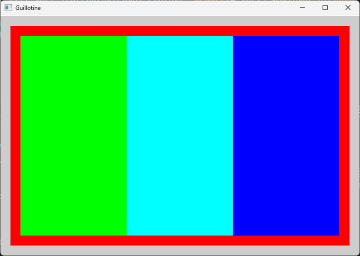

# Guillotine

Guillotine is a toy GUI library for C3. It uses Blend2d to draw directly to a GLFW window. It's very bad, you shouldn't use it.

## Features
Not many, but here we go:

- Components
  - Background box
  - Container (adds padding to child)
  - Layout (arranges children in a row or column with constraints)
  - Label (displays text)

## TODO
- Resize the canvas when the window is resized
- Add some more components
- Make the construction of gui tree less verbose
- Figure out a way to handle events

## Witness the unstoppable power of this incredible library

